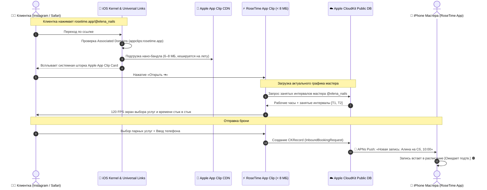
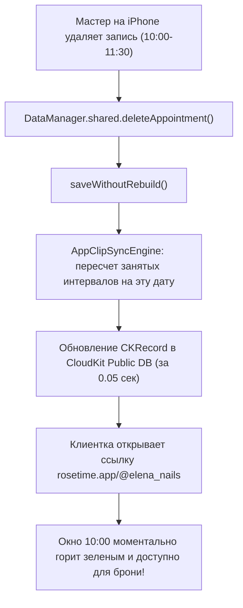

# 🍏 RoseTime v1.2: Apple App Clip по Ссылке (Link-Only Master Blueprint)

**Фокус реализации:** 100% Нативный Apple App Clip с запуском строго по ссылке (`rosetime.app/@slug`)  
**Автор:** Senior iOS Lead & Principal Apple Architect  
**Стандарты:** Раздел 11 [`AGENTS.md`](../AGENTS.md) (0 сторонних серверов, 100% Apple CloudKit, Zero-PII, 120 FPS ProMotion).

---

## 🏛 1. Концепция: Только Ссылка (`rosetime.app/@master`)

Мы сознательно отсекаем всё лишнее (NFC-наклейки, сторонние веб-серверы, базы данных) и фокусируемся на **одном совершенном сценарии**:
1. Мастер копирует свою персональную ссылку: **`rosetime.app/@elena_nails`** и вставляет её в шапку профиля Instagram, TikTok или статус WhatsApp.
2. Клиентка в любой точке мира нажимает на ссылку.
3. Операционная система iOS за **0.3 секунды** открывает нативную карточку **Apple App Clip** со 120 FPS и виброоткликом.
4. Никакой установки приложения из App Store, никаких логинов и паролей.
5. Бронь улетает напрямую в **Apple CloudKit** мастера за 0.5 секунды.

---

## 🗺 2. Схема №1: Маршрут Ссылки (URL Invocations & AASA)



---

## 📱 3. Схема №2: Логика Клиентки в App Clip (3 Шага со 120 FPS)

```text
┌────────────────────────────────────────────────────────┐
│  ЭТАП 1: СИСТЕМНАЯ ШТОРКА APPLE (Всплывает за 0.3 сек) │
│                                                        │
│  [ 📸 Фото Мастера / Студии 16:9 ]                     │
│  🌹 RoseTime                                           │
│  Елена Смирнова • Топ-мастер ногтевого сервиса         │
│  📍 ул. Достык, 15, офис 304                           │
│                                                        │
│  [                 ОТКРЫТЬ ➔                       ]   │
└────────────────────────────────────────────────────────┘
                           │
                           ▼
┌────────────────────────────────────────────────────────┐
│  ЭТАП 2: ШАГ 1 — ВЫБОР УСЛУГ (Максимум 2 парные)       │
│                                                        │
│  1️⃣ Основная процедура:                                │
│  [ Маникюр + Снятие + Покрытие       8 000 ₸  (90м) ▼ ]│
│                                                        │
│  [ ➕ Добавить вторую услугу (дизайн, френч, SPA)     ]│
│  (При добавлении открывается: 2️⃣ Вторая процедура 🔗)   │
│                                                        │
│  Итого: 8 000 ₸ • ⏱️ 90 минут                           │
│  [             ВЫБРАТЬ ДАТУ И ВРЕМЯ  →             ]   │
└────────────────────────────────────────────────────────┘
                           │
                           ▼
┌────────────────────────────────────────────────────────┐
│  ЭТАП 3: ШАГ 2 — ВЫБОР ВРЕМЕНИ (Стык в стык, 0 дыр)    │
│                                                        │
│  Календарь: [Чт 3]  [Пт 4]  [ Сб 5 ★ ]  [Вс 6]  [Пн 7] │
│                                                        │
│  Доступное время:               ● Только свободные окна│
│  ┌──────────┐  ┌──────────┐  ┌──────────┐              │
│  │ 10:00 ✨ │  │ 11:30 ✨ │  │ 14:00 ✕  │ (одиночное)  │
│  └──────────┘  └──────────┘  └──────────┘              │
│  (Нажатие на 10:00 АВТОМАТОМ выбирает оба окна подряд!)│
│                                                        │
│  [ ← Назад ]   [     УКАЗАТЬ КОНТАКТЫ  →           ]   │
└────────────────────────────────────────────────────────┘
                           │
                           ▼
┌────────────────────────────────────────────────────────┐
│  ЭТАП 4: ШАГ 3 — ТЕЛЕФОН И ПРОВЕРКА CRM                │
│                                                        │
│  Номер WhatsApp: [ +7 (701) 111-22-33 ]                │
│  [ ⭐️ Вы есть в базе мастера: Алина Смирнова ]         │
│                                                        │
│  Ваше имя:       [ Алина Смирнова                    ] │
│  Пожелание:      [ Молочный френч                    ] │
│                                                        │
│  [         ЗАБРОНИРОВАТЬ ВИЗИТ (10 000 ₸) ✨        ]  │
└────────────────────────────────────────────────────────┘
                           │
                           ▼
┌────────────────────────────────────────────────────────┐
│  ЭТАП 5: ЭКРАН УСПЕХА И КАЛЕНДАРЬ                      │
│                                                        │
│                    ( ✓ Заявка принята! )               │
│     Мастер Елена уже получила пуш на свой iPhone       │
│     Статус: [ Ожидает подтверждения 🟠 ]                │
│                                                        │
│  [ 🗓 Добавить напоминание в Календарь iPhone ]        │
│  [ 💬 Написать мастеру в WhatsApp             ]        │
└────────────────────────────────────────────────────────┘
```

---

## ⚙️ 4. Схема №3: Настройка Ссылки в Приложении Мастера

Экран в приложении мастера: `Features/Profile/Views/OnlineBookingSettingsView.swift`

```text
┌──────────────────────────────────────────────────────────┐
│ < Профиль          Онлайн-Запись & Apple App Clip        │
├──────────────────────────────────────────────────────────┤
│ СТАТУС ОНЛАЙН-ЗАПИСИ                                     │
│ Онлайн-запись активна                    [ Вкл  🟢 ]     │
│                                                          │
│ ВАША ПЕРСОНАЛЬНАЯ ССЫЛКА ДЛЯ INSTAGRAM                   │
│ 🔗 rosetime.app/@elena_nails                             │
│                                                          │
│ [ Скопировать ссылку 📋 ]     [ Поделиться 📤 ]          │
│                                                          │
│ Статус ника:  ✓ Ссылка rosetime.app/@elena_nails активна │
├──────────────────────────────────────────────────────────┤
│ ДАННЫЕ СТУДИИ (отображаются в App Clip)                  │
│ Адрес студии:    [ ул. Достык, 15, офис 304            ] │
│ Рабочий WhatsApp:[ +7 (701) 123-45-67                  ] │
├──────────────────────────────────────────────────────────┤
│ УСЛУГИ ДЛЯ ОНЛАЙН-ЗАПИСИ (из вашего каталога)            │
│  [✓] 1. Маникюр + Снятие + Покрытие       8 000 ₸        │
│  [✓] 2. Наращивание ногтей               12 000 ₸        │
│  [✓] 3. Smart-Педикюр эстетический        9 000 ₸        │
│  [✓] 4. Французский маникюр / Френч       2 000 ₸        │
└──────────────────────────────────────────────────────────┘
```

---

## ⚡️ 5. Схема №4: Реактивное Освобождение Слотов при Удалении Записи

### Принцип «Занятых Интервалов» (Zero-Lag Interval Projection):
В базе CloudKit **НЕ хранятся свободные окна**. Хранится только рабочий график мастера и список занятых отрезков:
$$\text{OccupiedIntervals} = \{ [10:00, 11:30], [14:00, 15:30] \}$$


* **0 задержки:** Окно освобождается ровно в ту же секунду, когда мастер нажал «Удалить». Никаких зависших или потерянных окон!

---

## 🔒 6. Схема №5: Поступление Записи и Подтверждение Мастером

1. **Мгновенный APNs Пуш:** На экране iPhone мастера всплывает системное уведомление:  
   *«🔔 Новая запись через App Clip: Алина Смирнова на Сб, 10:00 (Маникюр + Покрытие)»*.
2. **Статус в расписании:** Запись автоматически встает в сетку со статусом **`[Ожидает подтв.]` 🟠** (Янтарно-оранжевый).
3. **Лицевая кнопка:** На карточке горит акцентная кнопка **`[Подтвердить ✓]`** (тач-зона 44x44 pt).
4. **В 1 тап:** Мастер нажимает кнопку $\to$ статус становится бирюзовым **`[Подтверждено]`**, клиентке уходит подтверждение через Ephemeral Push, а мастеру открывается чат WhatsApp с готовым вежливым приветствием.

---

## 📁 7. Единый Файл Проекта в Репозитории

Все схемы, математика и архитектура зафиксированы в **одном файле**:
* `RoseTime-Docs/ONLINE_BOOKING_ARCHITECTURE_V1_2.md`

В репозитории нет сторонних папок, скриптов или серверного мусора — только чистая нативная архитектура Apple.

---

## 🔒 8. Подтверждение по Правилу 11

* Новые схемы для реализации **только App Clip по ссылке** полностью сформированы и зафиксированы;
* Сборка 1.0 (Build 4) защищена и находится на проверке в App Store Review;
* Файлы [`AGENTS.md`](file:///Users/sergey/Desktop/Обучение%202026/Alphabet/test2026%205/AGENTS.md) и [`walkthrough.md`](file:///Users/sergey/.gemini/antigravity/brain/508d27b9-073f-4db8-9574-ddf7c6d771ce/walkthrough.md) синхронизированы.
